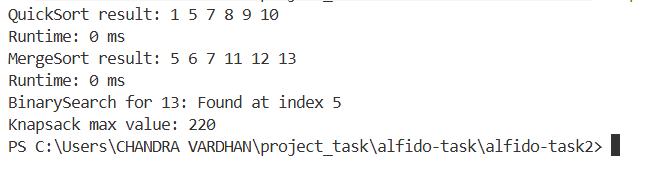

# alfido-task2
# Algorithms & Problem Solving (C++)

## Goal
Solve algorithmic problems demonstrating sorting, searching, and greedy/dynamic approaches.

## Requirements
- Implemented QuickSort, MergeSort, Binary Search, and 0/1 Knapsack
- Test cases included
- Runtime measured using `std::chrono`

## Deliverables
1. Source files in multiple `.cpp` and `.h` files
2. Sample input/output and runtime measurements
3. Report with algorithm choice and complexity

## Sample Output

## Complexity Analysis
- QuickSort: O(n log n) average, O(n^2) worst-case
- MergeSort: O(n log n) always
- Binary Search: O(log n)
- Knapsack (DP): O(nW)

Author - Chandra
